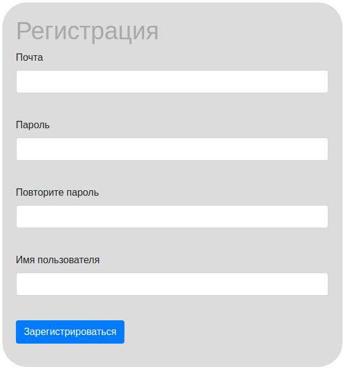
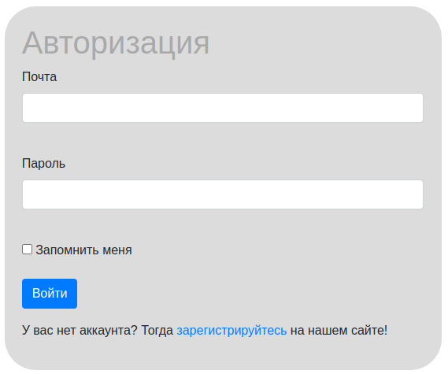

# Tank Duel Website

# Краткая характеристика
* Наименование программы: **Вебсайт - Танковая дуэль** - сайт для поклонников игры **Танковая дуэль**.
* Назначение программы: удобное общение поклоников игры **Танковая дуэль**.
* Конечные пользователи: поклоники игры **Танковая дуэль**.

# Техническое задание
При помощи **web-программирования** создать приложение на языке Python для удобного общения поклонников игры **Танковая дуэль**.

# Сборка и запуск
Разработка и тестирование программы осуществлено в операционной системе Windows 10. Для успешного запуска и нормальной работы должно быть установлено следующее программное обеспечение:

+ язык Python **3.10.0**
+ web-фреймворк **Flask==2.0.3**
+ библиотека **Flask-WTF 1.0.0**
+ библиотека **SQLAlchemy .4.32**
+ библиотека **WTForms 3.0.1**
+ библиотека **Flask-Login==0.5.0**

## Файловая структура проекта
```text
[TD_Website]            # Директория приложения
├── [data]              # Модели
├── [db]                # База данных
├──┬ [static]           # Статический контент
│  ├── [css]            # Стили
│  └── [img]            # Изображения
├── [templates]         # Шаблоны страниц
├── params.py           # Python-файл с параметрами игры
├── README.md           # Документация к игре
├── requirements.txt    # Список внешних зависимостей
└── main.py             # main-файл
```

# Функции

## Регистрация



## Вход


